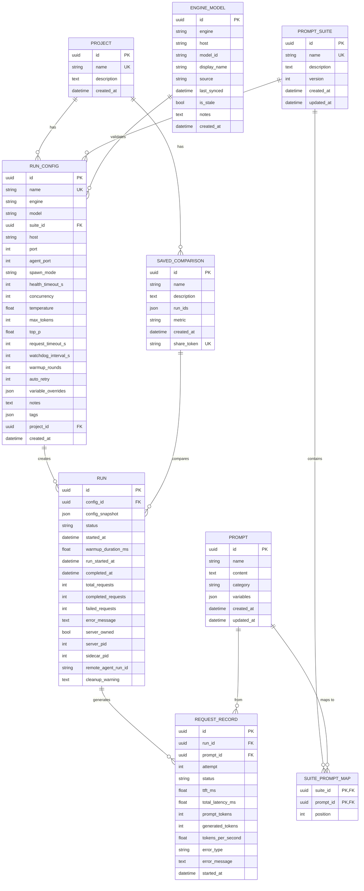

# Data Model Diagram

## Entity Relationship Diagram

## Key Relationships

### Core Execution Flow
1. **RUN_CONFIG** → **PROMPT_SUITE** (which suite of prompts to run)
2. **RUN_CONFIG** → **RUN** (creates one or more runs)
3. **RUN** → **REQUEST_RECORD** (generates one record per prompt request)
4. **REQUEST_RECORD** ← **PROMPT** (links to the prompt used)

### Prompt Organization
- **PROMPT_SUITE** contains **PROMPT**s via **SUITE_PROMPT_MAP** (preserves order via `position`)
- **SUITE_PROMPT_MAP** is a join table with ordering semantics

### Discovery & Validation
- **ENGINE_MODEL** stores known models per engine+host (populated via sync or manual entry)
- Used to validate **RUN_CONFIG.model** without requiring live engine connection

### Grouping & Analysis
- **PROJECT** groups **RUN_CONFIG**s and **SAVED_COMPARISON**s
- **SAVED_COMPARISON** captures a set of **RUN**s for side-by-side analysis

### Process Tracking
- **RUN** tracks:
  - Timeline: `started_at` → `run_started_at` (sidecar start) → `completed_at`
  - Progress: `total_requests`, `completed_requests`, `failed_requests`
  - Ownership: `server_owned`, `server_pid` (if agent spawned it)
  - Remote: `remote_agent_run_id` (for Tailscale agent coordination)

### Metrics & Results
- **REQUEST_RECORD** captures per-request metrics:
  - `ttft_ms` (time to first token)
  - `total_latency_ms` (total request time)
  - `tokens_per_second` (engine-reported or wall-clock)
  - `prompt_tokens`, `generated_tokens` (from engine ResponseMeta)
  - Retries tracked via `attempt` field

## Constraints & Uniqueness

| Table | Unique Constraint | Notes |
|-------|-------------------|-------|
| PROJECT | name | One name per project |
| PROMPT_SUITE | name | One name per suite |
| RUN_CONFIG | name | One name per config |
| SUITE_PROMPT_MAP | (suite_id, prompt_id) | Composite PK; position enforces order |
| SAVED_COMPARISON | share_token | For shareable URLs |
| ENGINE_MODEL | (engine, host, model_id) | No duplicates per engine+host+model |

## Cascades

- **PROMPT_SUITE** → **SUITE_PROMPT_MAP**: `delete-orphan` (removing suite deletes mappings)
- **PROMPT** → **SUITE_PROMPT_MAP**: `delete-orphan` (removing prompt deletes mappings)
- **RUN** → **REQUEST_RECORD**: `delete-orphan` (deleting run deletes its records)
